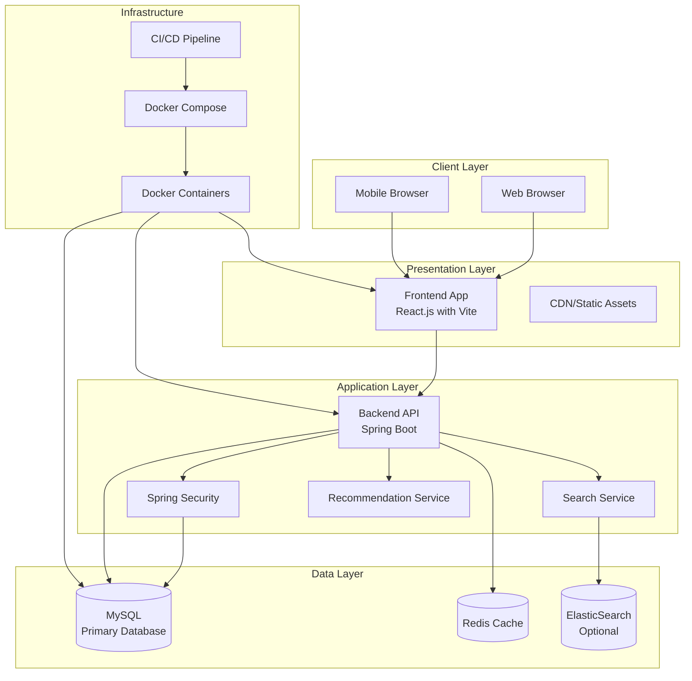
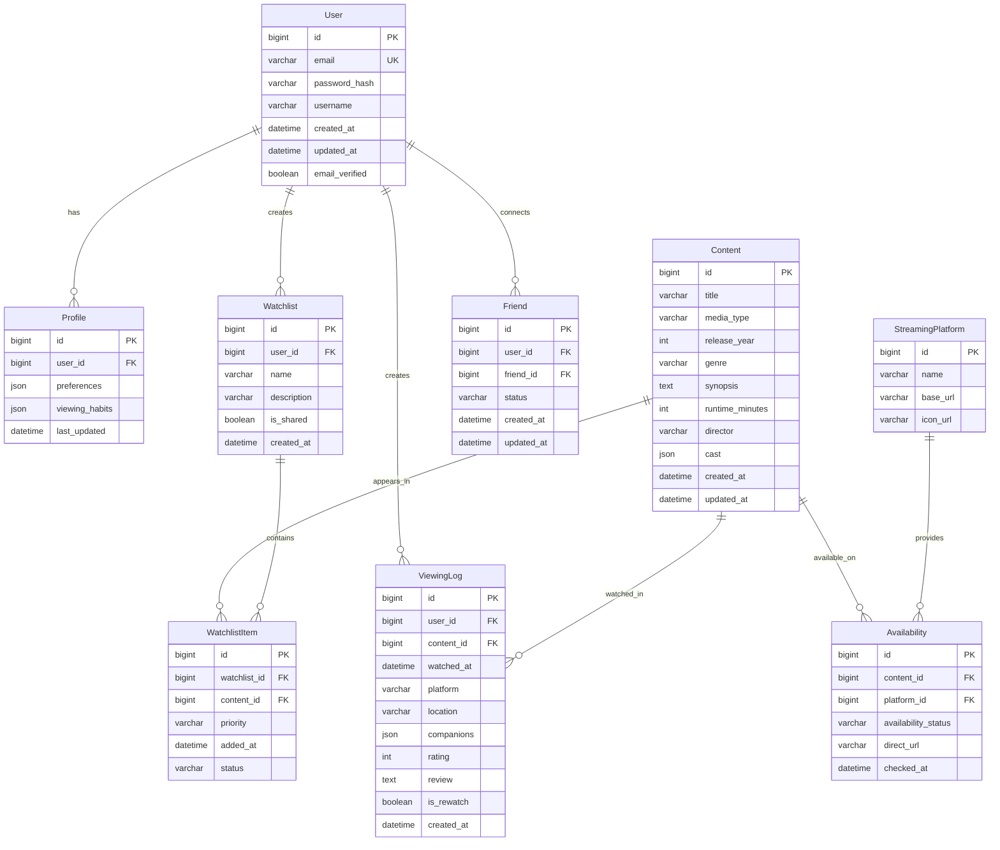
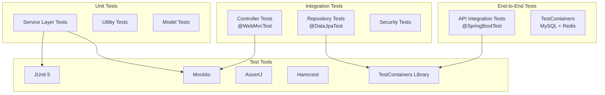
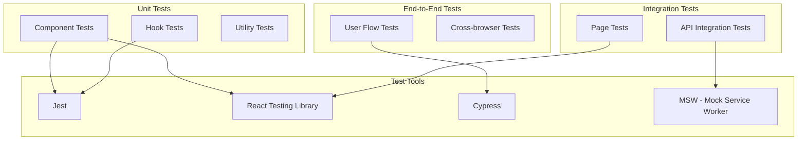

# Movie Rating System - Architecture Diagrams (Spring Boot + React.js + MySQL)

## System Overview

### High-Level Architecture


## Technology Stack Details

### Backend (Spring Boot)
- **Framework**: Spring Boot 3.x with Java 17+
- **Security**: Spring Security with JWT authentication
- **Persistence**: Spring Data JPA with Hibernate
- **API Documentation**: SpringDoc OpenAPI 3
- **Testing**: JUnit 5, Mockito, Spring Boot Test
- **Build Tool**: Maven or Gradle

### Frontend (React.js)
- **Framework**: React 18+ with TypeScript
- **Build Tool**: Vite for fast development
- **State Management**: React Context + useReducer or Redux Toolkit
- **UI Library**: Material-UI or Chakra UI
- **Routing**: React Router DOM
- **HTTP Client**: Axios or React Query
- **Testing**: Jest, React Testing Library, Cypress

### Database (MySQL)
- **Version**: MySQL 8.0+
- **ORM**: Hibernate JPA
- **Connection Pool**: HikariCP
- **Migration Tool**: Flyway or Liquibase
- **Indexing**: Proper indexes for search performance

## Database Schema

### Core Entities Relationship (MySQL)


## Component Architecture

### Spring Boot Backend Structure
```
src/main/java/com/movierating/
├── config/                 # Configuration classes
├── controller/            # REST controllers
│   ├── UserController.java
│   ├── ContentController.java
│   ├── WatchlistController.java
│   ├── ViewingHistoryController.java
│   ├── SearchController.java
│   ├── StatisticsController.java
│   ├── SocialController.java
│   └── PlatformController.java
├── service/               # Business logic
│   ├── UserService.java
│   ├── ContentService.java
│   ├── WatchlistService.java
│   ├── ViewingHistoryService.java
│   ├── SearchService.java
│   ├── StatisticsService.java
│   ├── SocialService.java
│   └── PlatformService.java
├── repository/            # Data access (JPA)
│   ├── UserRepository.java
│   ├── ContentRepository.java
│   ├── WatchlistRepository.java
│   ├── ViewingLogRepository.java
│   ├── FriendRepository.java
│   └── AvailabilityRepository.java
├── model/                 # Entity classes
│   ├── User.java
│   ├── Profile.java
│   ├── Content.java
│   ├── Watchlist.java
│   ├── WatchlistItem.java
│   ├── ViewingLog.java
│   ├── Friend.java
│   └── Availability.java
├── dto/                   # Data Transfer Objects
├── security/              # Security configuration
├── exception/             # Custom exceptions
└── MovieRatingApplication.java
```

### React.js Frontend Structure
```
src/
├── components/           # Reusable UI components
│   ├── common/          # Common components
│   │   ├── Button/
│   │   ├── Card/
│   │   ├── Modal/
│   │   └── LoadingSpinner/
│   ├── layout/          # Layout components
│   │   ├── Header/
│   │   ├── Sidebar/
│   │   └── Footer/
│   └── features/        # Feature-specific components
│       ├── auth/
│       ├── content/
│       ├── watchlist/
│       ├── history/
│       ├── search/
│       ├── statistics/
│       ├── social/
│       └── platforms/
├── pages/               # Page components
│   ├── LoginPage/
│   ├── RegisterPage/
│   ├── DashboardPage/
│   ├── ContentCatalogPage/
│   ├── WatchlistPage/
│   ├── ViewingHistoryPage/
│   ├── SearchPage/
│   ├── StatisticsPage/
│   ├── SocialPage/
│   └── SettingsPage/
├── services/            # API service layer
│   ├── apiClient.js
│   ├── authService.js
│   ├── userService.js
│   ├── contentService.js
│   ├── watchlistService.js
│   ├── viewingHistoryService.js
│   ├── searchService.js
│   ├── statisticsService.js
│   ├── socialService.js
│   └── platformService.js
├── store/               # State management
│   ├── slices/         # Redux slices
│   └── store.js
├── hooks/               # Custom React hooks
├── utils/               # Utility functions
├── constants/           # Constants and config
├── styles/              # Global styles
├── App.jsx              # Main App component
└── main.jsx             # Entry point
```

## Deployment Architecture

### Docker Compose Setup
```yaml
version: '3.8'
services:
  mysql:
    image: mysql:8.0
    environment:
      MYSQL_ROOT_PASSWORD: ${DB_ROOT_PASSWORD}
      MYSQL_DATABASE: movierating
      MYSQL_USER: ${DB_USER}
      MYSQL_PASSWORD: ${DB_PASSWORD}
    ports:
      - "3306:3306"
    volumes:
      - mysql_data:/var/lib/mysql
    healthcheck:
      test: ["CMD", "mysqladmin", "ping", "-h", "localhost"]
      timeout: 20s
      retries: 10

  redis:
    image: redis:7-alpine
    ports:
      - "6379:6379"
    volumes:
      - redis_data:/data

  backend:
    build: ./backend
    depends_on:
      mysql:
        condition: service_healthy
      redis:
        condition: service_started
    environment:
      SPRING_DATASOURCE_URL: jdbc:mysql://mysql:3306/movierating
      SPRING_DATASOURCE_USERNAME: ${DB_USER}
      SPRING_DATASOURCE_PASSWORD: ${DB_PASSWORD}
      SPRING_REDIS_HOST: redis
    ports:
      - "8080:8080"

  frontend:
    build: ./frontend
    depends_on:
      - backend
    environment:
      VITE_API_BASE_URL: http://localhost:8080/api
    ports:
      - "3000:3000"

  nginx:
    image: nginx:alpine
    depends_on:
      - frontend
      - backend
    ports:
      - "80:80"
    volumes:
      - ./nginx.conf:/etc/nginx/nginx.conf

volumes:
  mysql_data:
  redis_data:
```

## API Layer Architecture

### Spring Boot REST API Endpoints
```
/api
├── /auth
│   ├── POST /register          # User registration
│   ├── POST /login             # User login
│   ├── POST /logout            # User logout
│   ├── POST /refresh-token     # Refresh JWT token
│   └── POST /reset-password    # Password reset
├── /users
│   ├── GET  /{id}              # Get user by ID
│   ├── PUT  /{id}              # Update user
│   ├── GET  /{id}/profile      # Get user profile
│   └── PUT  /{id}/profile      # Update user profile
├── /content
│   ├── GET  /                  # List content (paginated)
│   ├── POST /                  # Create content
│   ├── GET  /{id}              # Get content by ID
│   ├── PUT  /{id}              # Update content
│   ├── DELETE /{id}            # Delete content
│   └── POST /import            # Bulk import content
├── /watchlists
│   ├── GET  /                  # List user's watchlists
│   ├── POST /                  # Create watchlist
│   ├── GET  /{id}              # Get watchlist by ID
│   ├── PUT  /{id}              # Update watchlist
│   ├── DELETE /{id}            # Delete watchlist
│   ├── POST /{id}/items        # Add item to watchlist
│   └── DELETE /{id}/items/{itemId} # Remove item from watchlist
├── /viewing-history
│   ├── GET  /                  # List viewing history
│   ├── POST /                  # Log viewing
│   ├── PUT  /{id}              # Update viewing log
│   ├── DELETE /{id}            # Delete viewing log
│   └── POST /{id}/rating       # Add/update rating
├── /search
│   ├── GET  /                  # Search content
│   └── GET  /discovery         # Discovery features
├── /statistics
│   ├── GET  /analytics         # Viewing analytics
│   ├── GET  /genre-distribution # Genre distribution
│   ├── GET  /reports           # Monthly/yearly reports
│   └── GET  /badges            # Achievement badges
├── /social
│   ├── GET  /friends           # List friends
│   ├── POST /friends           # Send friend request
│   ├── PUT  /friends/{id}      # Accept/reject friend request
│   ├── DELETE /friends/{id}    # Remove friend
│   ├── GET  /activity          # Activity feed
│   └── POST /recommendations   # Send recommendation
└── /platforms
    ├── GET  /                  # List platforms
    ├── POST /                  # Add platform link
    ├── GET  /availability      # Check availability
    └── GET  /calendar/export   # Export to calendar
```

## Testing Architecture

### Spring Boot Testing Stack


### React.js Testing Stack


## Development Workflow

### TDD with Spring Boot
```
1. Write failing unit test for service method
2. Implement service method to pass test
3. Write failing integration test for controller
4. Implement controller endpoint to pass test
5. Write failing repository test
6. Implement repository method to pass test
7. Refactor while keeping all tests green
```

### TDD with React.js
```
1. Write failing component test (React Testing Library)
2. Implement component to pass test
3. Write failing hook test for business logic
4. Implement custom hook to pass test
5. Write failing integration test with mocked API
6. Implement API integration to pass test
7. Write failing E2E test (Cypress)
8. Implement complete user flow
9. Refactor while keeping all tests green
```

## Performance Considerations

### MySQL Optimization
- Proper indexing on frequently queried columns
- Query optimization with EXPLAIN analysis
- Connection pooling with HikariCP
- Read replicas for scaling read operations
- Partitioning for large tables (viewing_history)

### Spring Boot Optimization
- Caching with Spring Cache + Redis
- Async processing for long-running operations
- Connection pooling for database
- GZIP compression for API responses
- Proper thread pool configuration

### React.js Optimization
- Code splitting with React.lazy()
- Memoization with React.memo and useMemo
- Virtualization for long lists
- Image optimization and lazy loading
- Bundle size optimization with tree shaking

## Security Architecture

### Spring Security Configuration
- JWT-based authentication
- Role-based authorization (USER, ADMIN)
- Password encryption with BCrypt
- CSRF protection
- CORS configuration
- Rate limiting
- Input validation and sanitization
- SQL injection prevention (JPA parameterized queries)
- XSS protection

### React.js Security
- HTTPS enforcement
- Secure token storage (HttpOnly cookies)
- XSS protection with DOMPurify
- Content Security Policy (CSP)
- Input validation on client side
- Secure API communication

This architecture provides a robust, scalable foundation for the Movie Rating System using Spring Boot, React.js, and MySQL with comprehensive testing and security measures.