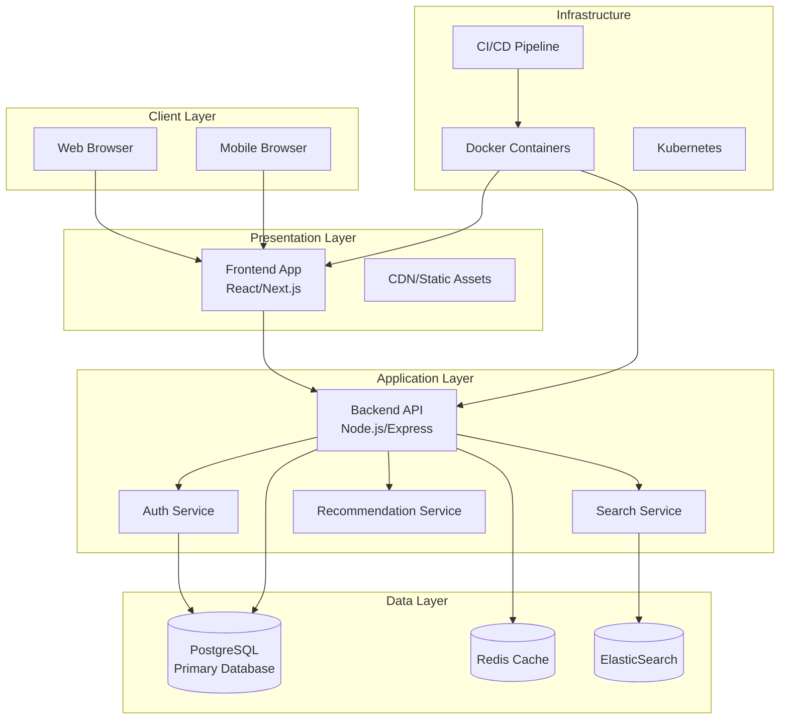
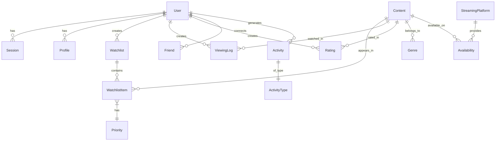
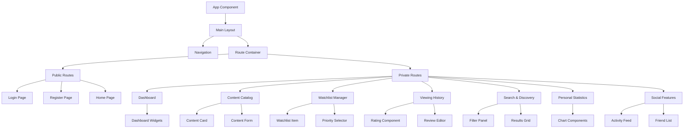
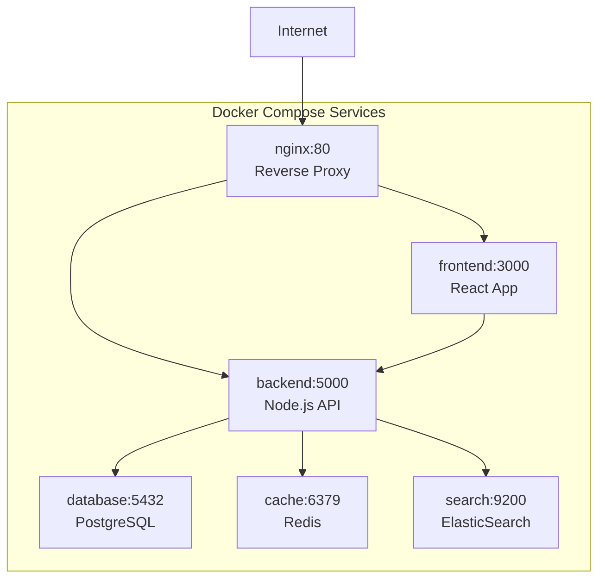
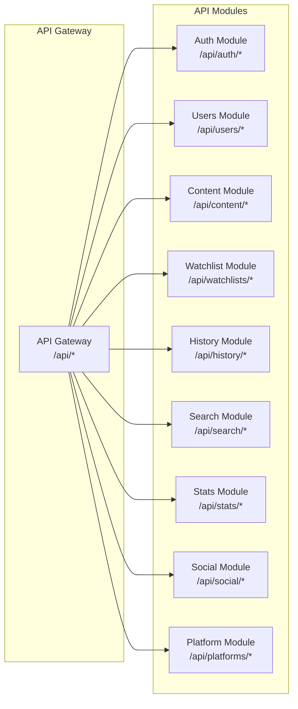
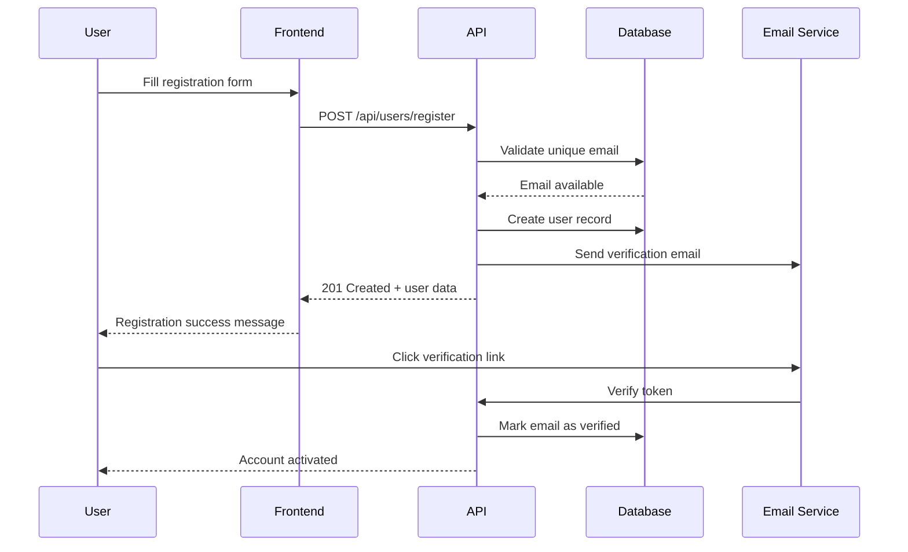
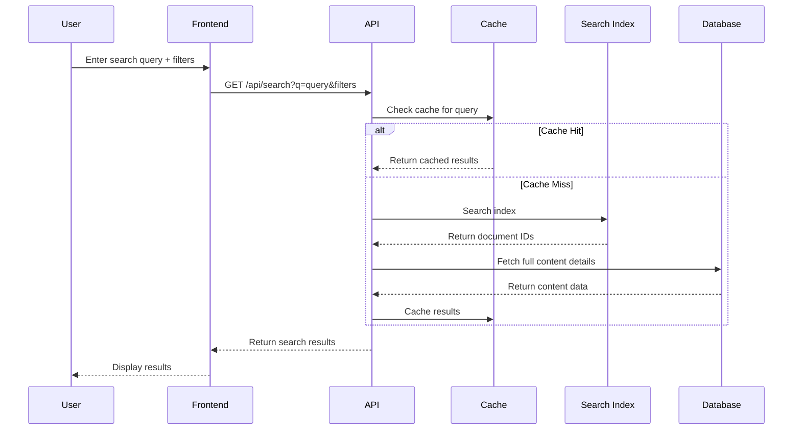
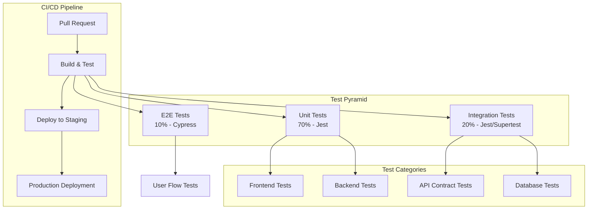
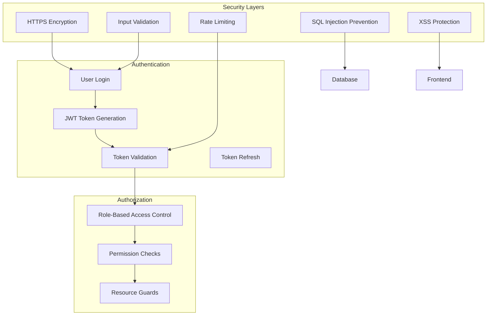
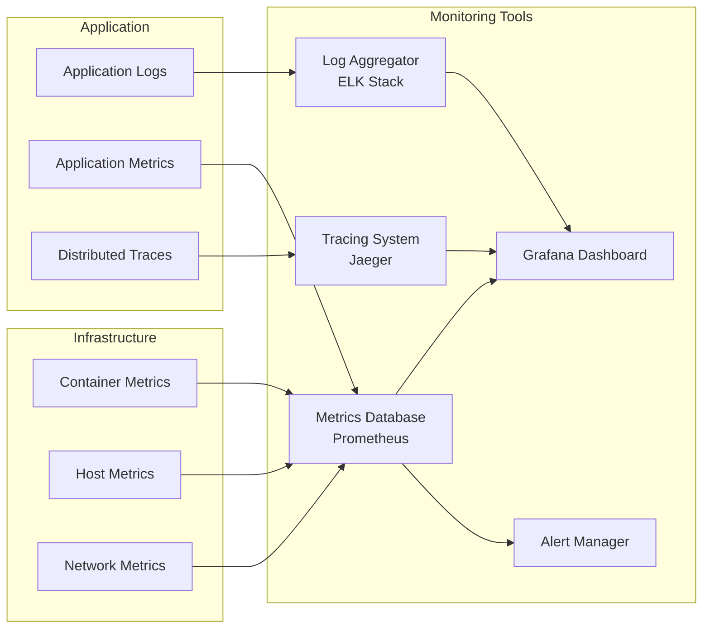

# Movie Rating System - Architecture Diagrams

## System Overview

### High-Level Architecture

## Database Schema

### Core Entities Relationship

## Component Architecture

### Frontend Component Hierarchy

## Deployment Architecture

### Docker Compose Setup

## API Layer Architecture

### REST API Structure

## Data Flow Diagrams

### User Registration Flow

### Content Search Flow

## Testing Architecture

### Test Pyramid Implementation

## Security Architecture

### Authentication & Authorization Flow

## Monitoring & Observability

### Monitoring Stack

This architecture provides a scalable, maintainable foundation for the Movie Rating System with clear separation of concerns, comprehensive testing strategy, and production-ready deployment configuration.